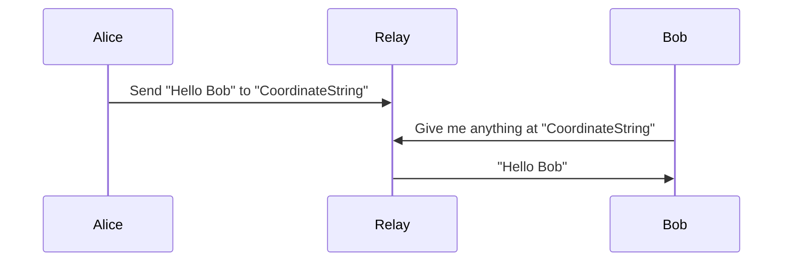

# nostr_dht
A simple library to send data to nostr and retrieve it.

### Purpose

Nostr provides a simple way to exchange 'posts' to a shared relay, which can power a decentralized social media network. See [Nostr.org](http://nostr.org) for more detail.

This library provides a simple way to use it to post some information and retrieve it. This means it can be used to send information without knowing the exact location or address of another, assuming both Alice and Bob have a shared "meeting point".

### Usage

Nostr DHT assumes that you have a message and a set of "coordinates" to put this information.

Or it assumes that you have a set of "coordinates" and want to retrieve the message.

